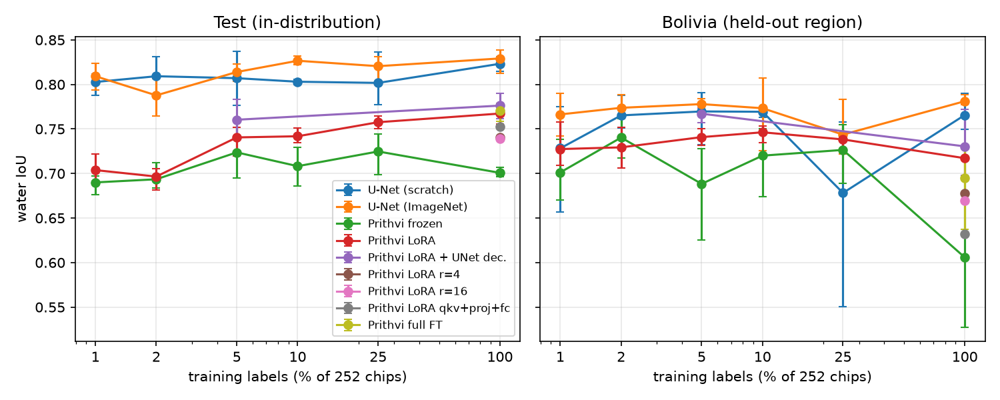
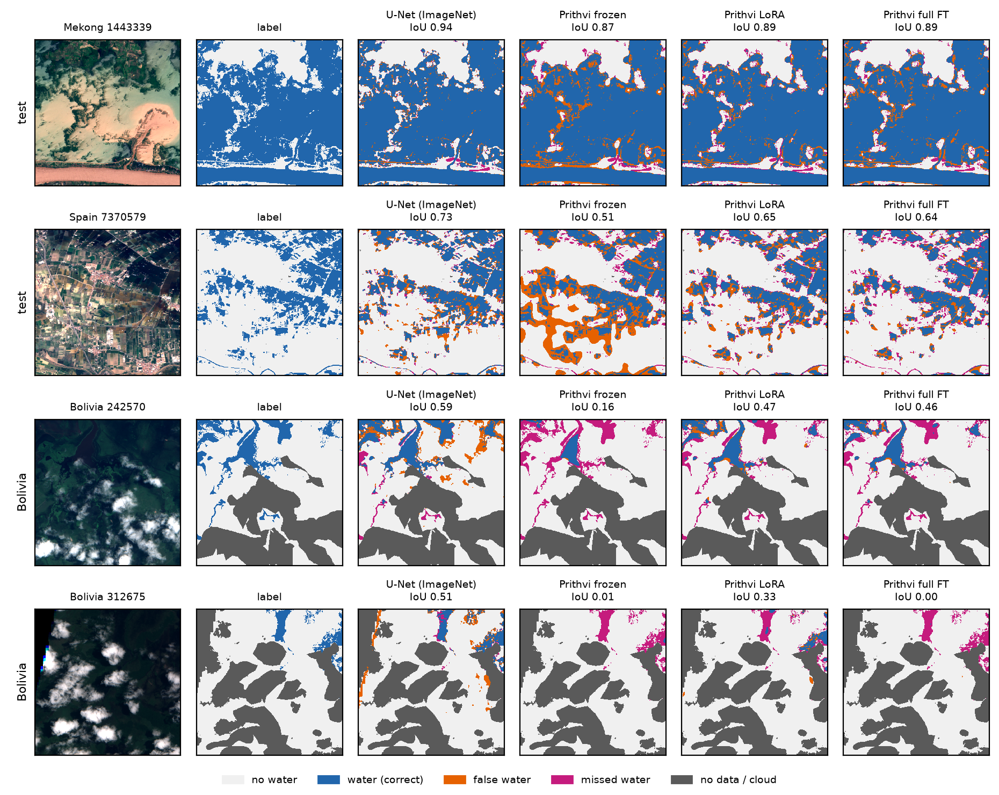

# eo-foundation-flood

Code, configurations and per-run results for the paper

**How Much Do Earth-Observation Foundation Models Help Flood Mapping When Labels Are Scarce? Frozen, LoRA and Full Fine-Tuning of Prithvi-EO 2.0 on Sen1Floods11** — Mert Semih Sarıyerli, 2026. Preprint: [doi:10.5281/zenodo.23105700](https://doi.org/10.5281/zenodo.23105700) · [PDF](paper/preprint.pdf)

[](https://doi.org/10.5281/zenodo.23105700)

A controlled comparison of two U-Nets (from scratch, ImageNet-initialized) with the Prithvi-EO 2.0 foundation model under three fine-tuning regimes (frozen encoder, LoRA, full fine-tuning) for Sentinel-2 flood segmentation on **Sen1Floods11**, from 100 % down to 1 % of the training labels.

## Research question

> How much does an EO foundation model buy over a conventional U-Net in the **low-label regime**, and which fine-tuning strategy (frozen encoder / LoRA / full fine-tune) gives the best accuracy per trainable parameter, including on the **out-of-distribution Bolivia split**?

| axis | values |
|---|---|
| model | `unet_scratch`, `unet_imagenet`, `prithvi_frozen`, `prithvi_lora`, `prithvi_full` (100 % labels only), plus LoRA rank / target / decoder ablations |
| training labels | 100 %, 25 %, 10 %, 5 %, 2 %, 1 % of the 252 hand-labeled training chips |
| seeds | 3 (the seed also draws the label subset) |
| budget | about 1,550 optimizer steps for every run |
| evaluation | Sen1Floods11 test split (in-distribution) + Bolivia split (held-out region) |
| metrics | water IoU, mIoU, water F1, trainable params, GPU minutes |

## Results

84 training runs, 12.7 GPU-hours on an RTX 3070 Ti (8 GB) and a Colab T4. Test water IoU, mean ± std over three seeds:

| labels (chips) | U-Net scratch | U-Net ImageNet | Prithvi frozen | Prithvi LoRA |
|---|---|---|---|---|
| 100 % (252) | 0.823 ± 0.008 | **0.829 ± 0.015** | 0.701 ± 0.005 | 0.767 ± 0.011 |
| 25 % (63) | 0.802 ± 0.031 | **0.820 ± 0.016** | 0.725 ± 0.024 | 0.758 ± 0.007 |
| 10 % (25) | 0.803 ± 0.003 | **0.827 ± 0.005** | 0.708 ± 0.022 | 0.742 ± 0.009 |
| 5 % (13) | 0.807 ± 0.031 | **0.814 ± 0.010** | 0.724 ± 0.034 | 0.741 ± 0.018 |
| 2 % (5) | **0.809 ± 0.022** | 0.788 ± 0.021 | 0.694 ± 0.016 | 0.697 ± 0.013 |
| 1 % (3) | 0.803 ± 0.013 | **0.809 ± 0.015** | 0.690 ± 0.012 | 0.704 ± 0.017 |

Prithvi full fine-tuning at 100 %: 0.770 ± 0.010.

- **The U-Nets lead at every label fraction**, and the gap to Prithvi LoRA grows from about 6 points at full labels to 10–11 points at 1–2 %.
- **LoRA matches full fine-tuning** (0.767 vs 0.770) with about 140x fewer trainable parameters (2.2 M vs 305 M).
- **Pretraining does not shrink the drop on the held-out Bolivia region**; the ImageNet U-Net transfers best.
- **Where Prithvi loses:** a pixel-level error analysis (seed 0) puts its excess errors within a few pixels of water edges and on water bodies below 0.1 km², consistent with the 16-pixel patch resolution.





Per-run metrics are in [results/results.csv](results/results.csv), the seed aggregates in [results/summary.csv](results/summary.csv), and the error analysis in [results/error_analysis.csv](results/error_analysis.csv) and [results/per_chip_iou.csv](results/per_chip_iou.csv). The day-by-day record of the experiments, including what did not work, is in [docs/LAB_NOTEBOOK.md](docs/LAB_NOTEBOOK.md).

## Setup

```bash
python -m venv .venv && source .venv/bin/activate   # Windows: .venv\Scripts\activate
pip install -e ".[dev]"            # core + tests
pip install -e ".[foundation]"     # adds terratorch + peft for Prithvi experiments
```

Python 3.10+ and a CUDA GPU are assumed for training. CPU is enough for the tests and for dataset inspection.

## Data

Sen1Floods11 (Bonafilia et al., 2020) — 446 hand-labeled 512×512 chips over 11 flood events, with Sentinel-1 (VV, VH), Sentinel-2 (13 bands) and a binary water label (`-1` = no data, `0` = no water, `1` = water). Official train/valid/test/Bolivia splits are shipped with the dataset.

```bash
python scripts/download_sen1floods11.py --root data/sen1floods11     # public bucket over HTTPS, ~1.8 GB, no account needed
python scripts/compute_stats.py --root data/sen1floods11             # per-band mean/std -> configs/data/stats.yaml
```

Details and band mapping in [docs/DATASET.md](docs/DATASET.md).

## Quickstart

```bash
# from-scratch U-Net on all labels
python -m eoflood.train --config configs/unet_scratch.yaml

# Prithvi-EO 2.0 + LoRA on 10 % of the labels, seed 1
python -m eoflood.train --config configs/prithvi_lora.yaml data.train_fraction=0.10 seed=1

# evaluate a checkpoint on the Bolivia split
python -m eoflood.evaluate --run runs/prithvi_lora_f0.10_s1 --split bolivia
```

Every run writes `config.yaml`, `metrics.csv`, `best.pt` and `test_metrics.json` under `runs/<name>/`.

To reproduce the paper's tables and figures from finished runs:

```bash
python scripts/run_matrix.py --models unet_scratch unet_imagenet prithvi_frozen prithvi_lora --fractions 1.0 0.25 0.10 0.05 0.02 0.01 --seeds 0 1 2
python scripts/collect_results.py      # runs/*/test_metrics.json -> results/results.csv, results/summary.csv
python scripts/make_tables.py          # LaTeX tables in paper/tables
python scripts/plot_results.py         # figures 1-3 in docs/figures
python scripts/qualitative.py          # figure 4 and the pixel-level error analysis (needs the seed-0 checkpoints)
```

## Layout

```
configs/            experiment configs (one file = one model recipe; override on the CLI)
src/eoflood/
  data/             Sen1Floods11 dataset + augmentations
  models/           U-Net baseline, Prithvi wrapper (frozen / LoRA / full), registry
  metrics.py        confusion-matrix based IoU / F1 with ignore index
  train.py          training loop (AMP, cosine LR, best-checkpoint on val water IoU)
  evaluate.py       evaluation on any split, optional prediction dumps
scripts/            download, statistics, run matrix, result tables, figures, error analysis
tests/              unit tests on synthetic rasters (no data download needed)
docs/               PLAN.md (12-week plan), DATASET.md, LAB_NOTEBOOK.md, figures
paper/              LaTeX source (main.tex, Turkish main_tr.tex), generated tables, preprint.pdf
results/            per-run and aggregated metrics (CSV)
```

## Citation

If this work is useful, please cite the preprint ([doi:10.5281/zenodo.23105700](https://doi.org/10.5281/zenodo.23105700)) together with the Sen1Floods11 and Prithvi-EO 2.0 papers:

```bibtex
@misc{sariyerli2026eofloods,
  title  = {How Much Do Earth-Observation Foundation Models Help Flood Mapping When Labels Are Scarce? Frozen, LoRA and Full Fine-Tuning of Prithvi-EO 2.0 on Sen1Floods11},
  author = {Sar{\i}yerli, Mert Semih},
  year   = {2026},
  publisher = {Zenodo},
  note   = {Preprint},
  doi    = {10.5281/zenodo.23105700},
  url    = {https://doi.org/10.5281/zenodo.23105700}
}
```

- Bonafilia et al., *Sen1Floods11: A georeferenced dataset to train and test deep learning flood algorithms for Sentinel-1*, CVPRW 2020.
- Szwarcman et al., *Prithvi-EO-2.0: A Versatile Multi-Temporal Foundation Model for Earth Observation Applications*, 2024.

## License

MIT — see [LICENSE](LICENSE).
